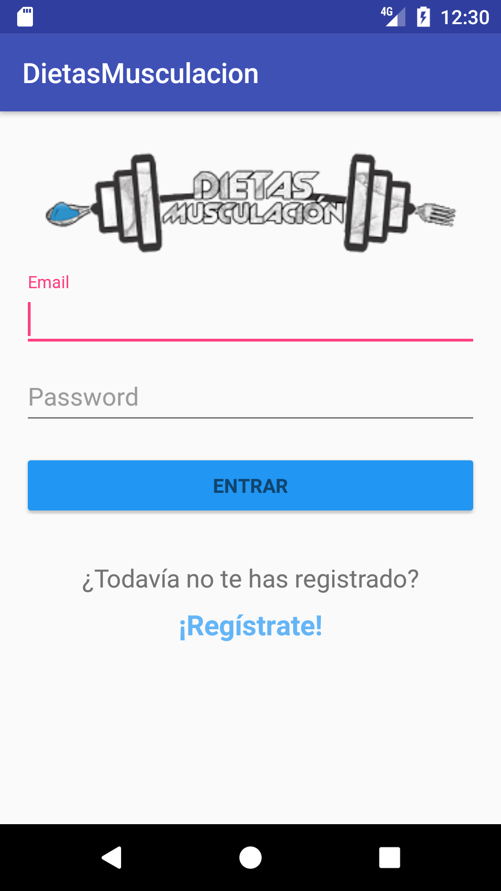
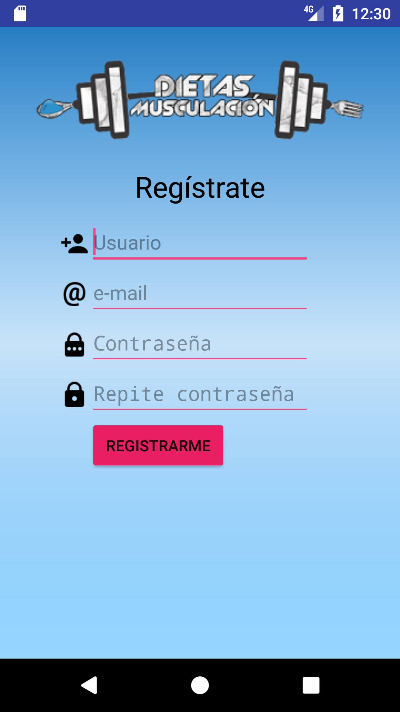
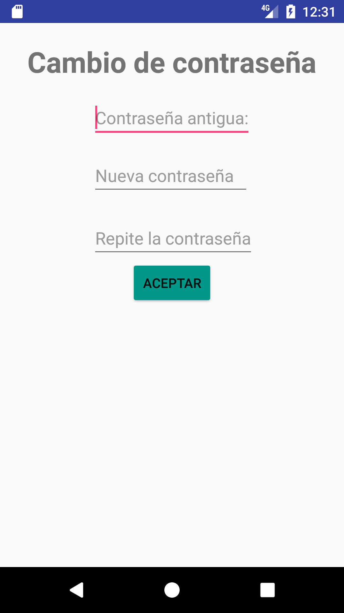

# CRUD

Proyecto CRUD en Android.
Este CRUD se ha realizado con el IDE Android Studio 2.3.
 
La parte del CRUD se encuentra la carpeta DatabaseHelper.
 

<table>
<tr>
<td></td>

<td></td>
</tr>
<tr>
<td></td>

<td></td>
</tr>
</table>
